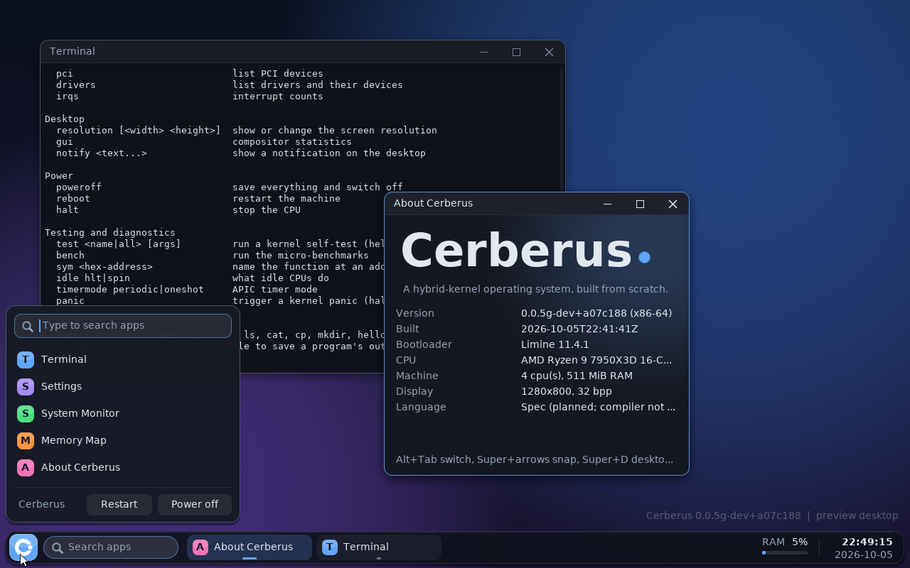
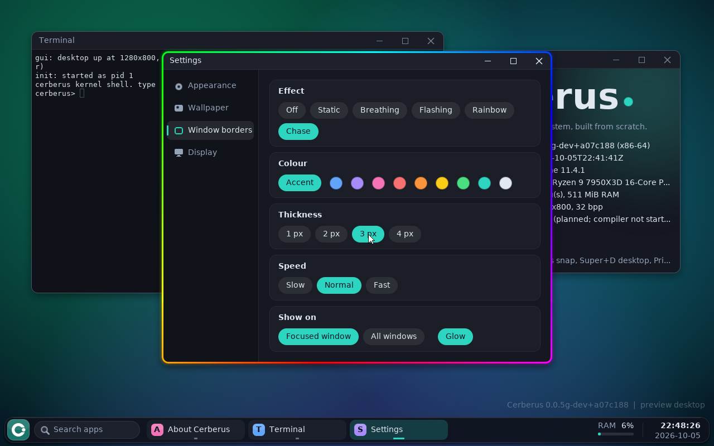
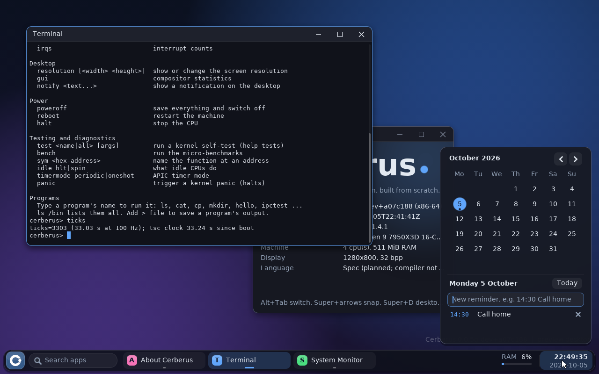
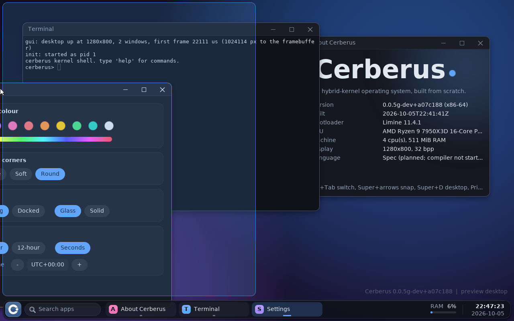

# Cerberus OS

**A 64-bit operating system written from scratch** — its own kernel, its own
file system, its own drivers, its own desktop — with **Spec**, a systems
programming language designed alongside it.

Nothing here is Linux, BSD or Windows underneath. Cerberus boots on bare
x86-64 hardware (today: QEMU and VirtualBox), brings up every CPU core, runs
protected user programs, stores files on a journaled disk format of its own,
and draws a desktop with windows you can move, resize and close.

> **Status: early.** Version `0.0.5g`. Build phases 0 to 11 of 19 are done.
> It runs in a virtual machine, not yet on your laptop, and it is not
> ready for real data. See [What works today](#what-works-today) and
> [Where it is going](#where-it-is-going).









---

## Why

Three goals, in this order:

1. **Private and secure by design.** No telemetry, nothing leaves the
   machine unless you ask. Security rules are requirements with tests, not
   afterthoughts: memory is never writable and executable at once, every
   system-call argument is treated as hostile, programs get the least
   access that works.
2. **Fast and small.** A context switch in about 24 nanoseconds, a system
   call in about 32, a message between two programs in well under a
   microsecond; an idle desktop uses 0% CPU. Every budget is measured and
   recorded in [docs/BENCH.md](docs/BENCH.md).
3. **Understandable.** One codebase you can read end to end, with a written
   specification ([docs/SPEC.md](docs/SPEC.md)) and the reasoning behind
   every decision ([docs/DECISIONS.md](docs/DECISIONS.md)).

## What works today

| Area | What is there |
|---|---|
| **Boot** | BIOS and UEFI through the Limine bootloader; ACPI, APIC, HPET; all CPU cores started (tested with 4). |
| **Memory** | Physical frame allocator; per-process address spaces; demand paging; copy-on-write `fork`; guard pages; kernel heap with per-CPU pools and corruption detection. |
| **Scheduler** | Preemptive, four priority levels, per-CPU run queues with work stealing; mutexes, semaphores, condition variables; lock-order checking in debug builds. |
| **User programs** | Ring-3 processes loaded from position-independent ELF files; ASLR; `fork`/`execve`/`waitpid`; 74 system calls ([docs/SYSCALLS.md](docs/SYSCALLS.md)); a small C library. |
| **Threads & IPC** | Threads inside a program (pthread-style API, thread-local storage); futex-based locks; **ports** (named message channels that can carry open files and shared memory, with access control and unforgeable sender identity); shared memory; signals; event queues so servers sleep instead of polling. |
| **Files** | A virtual file system with mounts, symbolic links and permissions; an in-memory file system; **cerfs**, a journaled, checksummed on-disk file system that survives power cuts; a page cache with read-ahead. |
| **Drivers** | AHCI (SATA), NVMe, virtio-blk, IDE; PCI with MSI; PS/2 keyboard and mouse; VirtualBox guest device (absolute mouse); framebuffer with resolution switching; ACPI power off and restart. |
| **Desktop** | A compositor with anti-aliased text, rounded windows with shadows and open/close animations, a taskbar with a launcher and app search, a calendar with reminders and notifications, a terminal with scrollback, history and Tab completion, a system monitor. Windows move, resize, snap to the screen's edges, minimise and maximise; Alt+Tab switcher, Super+D, right-click menu, Print Screen. A Settings window changes the accent colour (any hue), six wallpapers, animated RGB window borders, the time zone, the screen resolution (up to 32:9 ultrawide) and the frame rate. |
| **Hardening** | W^X everywhere, SMEP/SMAP/UMIP, stack protectors, a ChaCha20 kernel random generator, validated user-memory access, fuzzers for the ELF loader, the archive reader, the file system and the system-call interface. |

Measured on the current build (QEMU/KVM, 4 cores): 100,000 messages through
a port in 68 ms with none lost or reordered; a server blocked waiting for
events wakes about 50 microseconds after a message is sent.

A plain-language tour is in [docs/ABOUT.md](docs/ABOUT.md); the exact,
verified state is always in [docs/STATUS.md](docs/STATUS.md).

## The early stages (how it got here)

Cerberus is built in numbered phases, each ending in a tested release. No
phase starts until the one before it passes its acceptance tests.

| Phase | What it added |
|---|---|
| 0–3 | Toolchain, boot, text console, interrupts, timers, the physical memory allocator |
| 4–5 | Virtual memory (paging, copy-on-write) and the kernel heap |
| 6 | Threads, processes and the scheduler |
| 7 | User mode: system calls, the ELF loader, `fork`/`exec`, the first programs |
| 8 | Multi-core: every CPU scheduling, TLB shootdown, per-CPU data |
| 9 | Files: the VFS, the page cache, the cerfs file system, the first disk drivers |
| 10 | The driver model, NVMe and virtio disks, input devices, power management |
| 11 | Programs talking to each other: ports, shared memory, signals, threads, futexes, event queues |

The desktop you see in the screenshots is a preview that currently runs
inside the kernel; phase 12 moves it into its own protected program.

The project was called *Lumen* until October 2026.

## Where it is going

The full plan is [docs/ROADMAP.md](docs/ROADMAP.md). In order:

- **Phase 12 — Pane, the window server.** The desktop leaves the kernel and
  becomes an ordinary program; every window draws into its own shared
  buffer; programs cannot read each other's windows or keystrokes.
- **Phase 13 — Facet, the app toolkit, and the first real apps:** terminal,
  file manager, text editor, system monitor, settings, image viewer,
  calculator, and a settings app for themes, wallpapers and window effects.
- **Phase 14 — Networking:** network drivers, an in-tree TCP/IP stack,
  DHCP, DNS, sockets.
- **Phase 15 — Users, TLS and sandboxing:** accounts and logins, encrypted
  connections, per-application permissions.
- **Phase 15B — A web browser of our own,** starting with simple pages.
- **Phase 16 — Spec, the language** (see below): the compiler, the standard
  library, and the first system components written in it.
- **Phase 17 — POSIX layer and packages,** so existing software can be
  ported.
- **Phase 18 — The installer and disk encryption:** a bootable USB that
  installs Cerberus next to (or instead of) another system, with a boot
  menu to choose between them ([docs/INSTALLER.md](docs/INSTALLER.md)).
- **Phase 19 — Stretch:** real hardware (USB, audio, Wi-Fi on a few chosen
  chipsets), kernel ASLR, suspend/resume.

What it is **not** trying to be: a drop-in replacement for Linux or
Windows, or a home for mainstream commercial apps. The aim is a small,
honest, fast system that one person can understand.

## Spec, the language

Spec is the systems language planned for writing Cerberus's own programs
(and eventually parts of the system). A language designed together with its
operating system can express things a general-purpose one cannot:

- compiled to native code, statically typed, no garbage collector;
- **regions**: memory allocated inside a `region` block is freed at its
  closing brace, and the compiler stops references from escaping it;
- **system calls as typed parts of the language**, with no C layer between;
- **capability types**: a kernel handle such as an open file cannot be
  copied by accident or used after it is closed;
- **hardware register layouts** the compiler checks (it refuses a write to
  a read-only register);
- traits and generics, closures, exhaustive pattern matching, bounds-checked
  slices, compile-time evaluation.

The compiler has not been started (phase 16); the design is in
[docs/SPEC.md](docs/SPEC.md) and an overview is in
[docs/ABOUT.md](docs/ABOUT.md). Until it exists, the kernel and userland
are freestanding C++20 with no exceptions and no RTTI.

## Building and running

On Linux, or Windows with WSL2 (Ubuntu 24.04):

```sh
sudo apt install build-essential nasm xorriso qemu-system-x86 gdb python3 \
                 bison flex texinfo libgmp-dev libmpfr-dev libmpc-dev
./toolchain/build-cross.sh     # one-off: builds the x86_64-elf cross compiler (15-30 min)
make iso                       # kernel + userland + bootable ISO in build/
make run                       # boot it in QEMU (serial log on stdout)
```

Other targets:

| Command | What it does |
|---|---|
| `make test` | Boots the ISO headless in QEMU once per test in `tests/integration/` and checks the output (41 tests). |
| `make fuzz` | Fuzzes the ELF loader, archive reader, file system and system calls. |
| `make bench` | Runs the benchmarks behind docs/BENCH.md. |
| `make RELEASE=1 dist` | Produces the release image `dist/cerberus.iso`. |

**VirtualBox:** create a VM of type *Other/Unknown (64-bit)* with 2 or more
CPUs and 512 MiB or more of memory, and attach the ISO as its optical
drive. (The 32-bit "Other" type hides 64-bit mode and the bootloader will
refuse to start.) Add a SATA disk if you want somewhere to keep files; in
Cerberus, `mkfs.cerfs -y /dev/disk/sda` then `mount -t cerfs /dev/disk/sda /mnt`.

In the desktop: **Super** opens the launcher, **Super+T** a terminal,
**Alt+Tab** switches windows, **Alt+F4** closes one. Type `help` in the
terminal for the shell's commands and `run /bin/ipctest` (or `threadtest`,
`sigtest`, `eventtest`, `fstest`) to watch the self-tests.

## Repository layout

```
kernel/      the kernel: arch/ (x86-64), mm/, sched/, proc/, syscall/, fs/,
             ipc/, drivers/, gfx/ and gui/ (the desktop preview), lib/
userland/    the C library (libc/) and programs (bin/)
tests/       integration tests (expected-output scripts), fuzzers, kernel self-tests
tools/       build and test helpers (QEMU test driver, generators, host mkfs)
toolchain/   cross-compiler build script and the Limine bootloader binaries
docs/        the specification and everything written about the project
```

## Documentation

| File | What it is |
|---|---|
| [docs/ABOUT.md](docs/ABOUT.md) | What Cerberus and Spec are, explained for people |
| [docs/ROADMAP.md](docs/ROADMAP.md) | What it can do now and everything still planned |
| [docs/STATUS.md](docs/STATUS.md) | The exact current state, what was verified and how |
| [docs/SPEC.md](docs/SPEC.md) | The full build specification |
| [docs/DECISIONS.md](docs/DECISIONS.md) | Why things are the way they are |
| [docs/CHANGELOG.md](docs/CHANGELOG.md) | What changed in each release |
| [docs/SYSCALLS.md](docs/SYSCALLS.md) | Every system call (generated from the kernel's table) |
| [docs/BENCH.md](docs/BENCH.md) | Performance measurements |

## A word of caution

This is a young operating system. It has no user accounts yet (everything
runs as root), nothing on disk is encrypted, and it has only ever run in
virtual machines. Explore it, break it, read it — but do not trust it with
anything you care about yet.

## License

No license has been chosen yet; until one is added, all rights are
reserved by the author. The Limine bootloader binaries under `toolchain/`
are distributed under Limine's own BSD 2-Clause license.
